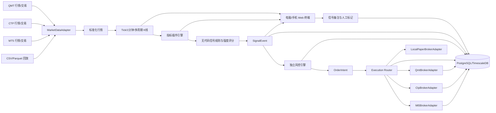

# A股、国内期货与 MT5 多市场自动化交易技术路线

## 1. 当前决策

- 开户、券商和期货公司暂不绑定，交易柜台通过适配器替换。
- A股预留 QMT/MiniQMT，国内期货预留 CTP，黄金/外汇沿用 MT5。
- 先完成行情、指标、信号、备注、回放和模拟撮合，再逐市场接模拟柜台。
- 所有市场默认 `paper`；实盘必须经过账户级开关、二次确认和风控开关。
- 指标代码不能直接调用交易接口，只能生成 `SignalEvent`；订单必须经过信号编排、风控和执行路由。

## 2. 总体架构



NautilusTrader 负责事件模型、指标生命周期、策略/信号回放和回测。FastAPI 负责配置、查询、人工确认和备注 API。实时交易引擎必须作为独立进程运行，不能依附在 Web 请求进程中。

## 3. 市场隔离

三个市场分别维护以下状态，不能交叉复用：

| 项目 | A股 | 国内期货 | 黄金/外汇 |
|---|---|---|---|
| 执行适配器 | QMT/MiniQMT | CTP | MT5 |
| 账户 | 独立证券账户 | 独立期货账户 | 独立 MT5 账户 |
| 资金币种 | CNY | CNY | USD 等 |
| 交易日历 | 沪深交易日/T+1 | 日盘、夜盘、交易日归属 | 24x5/经纪商时段 |
| 核心规则 | 100股整手、涨跌停、停牌、不可裸卖 | 合约乘数、保证金、今昨仓、换月 | 点差、最小手数、杠杆、隔夜费 |
| Kill Switch | 独立 | 独立 | 独立 |

同一指标定义可以复用，但每个 `市场 + 标的 + 周期` 都必须创建独立指标实例，不能共享滚动窗口和内部状态。

## 4. 自定义指标方案

系统提供两种入口，使使用者不必修改交易主程序。

### 4.1 无代码指标与规则

内置 MA、EMA、MACD、RSI、KDJ、BOLL、ATR、成交量和持仓量。界面中选择指标、参数和条件，例如：

```yaml
rule_id: rb_strong_long_v1
market: futures_cn
instrument: RB2510.SHFE
timeframe: 1-MINUTE
conditions:
  - indicator: EMA
    params: { period: 10 }
    operator: crosses_above
    compare_to: { indicator: EMA, params: { period: 30 } }
    weight: 35
  - indicator: RSI
    params: { period: 14 }
    operator: between
    value: [52, 72]
    weight: 20
  - indicator: VOLUME_RATIO
    params: { period: 20 }
    operator: greater_than
    value: 1.5
    weight: 25
  - indicator: ATR
    params: { period: 14 }
    operator: risk_gate
    value: 0.03
    weight: 20
entry_threshold: 60
strong_entry_threshold: 80
exit_threshold: 60
strong_exit_threshold: 80
manual_confirmation_required: true
```

规则保存后必须先通过历史回放；未通过回放的规则只能处于 `OBSERVE_ONLY`，可显示信号但不能生成订单。

### 4.2 Python 指标插件

复杂指标使用版本化插件，核心接口如下：

```python
class IndicatorPlugin(Protocol):
    plugin_id: str
    version: str

    def initialize(self, context: IndicatorContext) -> None: ...
    def update_bar(self, bar: NormalizedBar) -> IndicatorSnapshot: ...
    def reset(self) -> None: ...
```

约束：

- `update_bar` 内禁止网络请求、文件写入和下单。
- 输出必须包含指标值、是否就绪和计算时间。
- 插件版本、参数、代码哈希都写入信号快照，保证以后能复盘。
- 新插件可以在实盘进程中以 `OBSERVE_ONLY` 热加载；升级为可交易状态必须经过回放、人工确认并生成新版本。
- 有未完成订单或持仓时，不允许直接替换正在执行的指标版本。

## 5. 强入场点、强出场点和备注

### 5.1 信号等级

统一使用以下状态：

- `WATCH`：条件正在接近，只观察。
- `ENTRY`：普通入场候选。
- `STRONG_ENTRY`：综合分达到强入场阈值。
- `EXIT`：普通退出候选。
- `STRONG_EXIT`：综合分达到强退出阈值。
- `BLOCKED`：有信号，但被交易时段、账户状态或风控拒绝。

“强”不是单个布尔值，而是 `0-100` 分数加可解释原因。每次信号必须记录：

- 所有参与指标的即时值和权重。
- 触发规则、未满足规则和最终分数。
- K线时间、行情时间、价格和周期。
- 策略版本、指标版本、配置版本。
- 风控是否通过以及拒绝原因。

### 5.2 人工备注

电脑端和手机端的 K 线都提供“添加标记”：

- 市场、标的、周期、K线时间和价格自动填入。
- 类型可选：强入场、入场、观察、退出、强退出、错误信号、复盘。
- 可输入文字备注、标签、预期止损、预期止盈和有效期。
- 自动附加当时的指标快照、持仓、账户风险和对应订单编号。
- 备注可以关联信号、订单、成交或持仓，但不能被修改成另一条历史成交。
- 修改和删除采用追加版本，保留原记录和操作人，满足审计要求。

人工标记默认只做记录。需要它触发下单时，必须点击“生成交易意图”，再次确认数量、价格和止损，再进入风控；备注本身不能绕过风控直接下单。

## 6. 实时交易链路

```text
行情事件
  -> 数据合法性与时间戳检查
  -> K线聚合
  -> 指标插件逐个更新
  -> 规则引擎计算方向、分数和原因
  -> SignalEvent 持久化
  -> 账户/市场风控
  -> OrderIntent
  -> 二次确认（需要时）
  -> BrokerAdapter
  -> 委托回报/成交回报
  -> 持仓和资金对账
  -> 审计日志和页面推送
```

每个 `OrderIntent` 使用唯一幂等键。进程重启或网络重连后，必须先与柜台查询订单、成交、持仓和资金并完成对账，才能恢复自动下单。

## 7. 风控边界

风控位于指标和交易适配器之间，指标插件无权关闭：

- 允许交易的市场、账户、标的和时段白名单。
- 单笔最大数量/金额、账户最大仓位和品种集中度。
- 单笔止损、日亏损上限、最大回撤和连续亏损暂停。
- 行情陈旧、时钟漂移、报价异常、断线和回报丢失时禁止开仓。
- A股检查可用资金、可卖数量、T+1、涨跌停、停牌和整手规则。
- 期货检查保证金、合约乘数、涨跌停、今昨仓、临近交割和换月计划。
- 独立市场 Kill Switch、全局 Kill Switch 和“只允许平仓”模式。
- 默认不允许策略裸卖 A股；期货做空必须由品种配置显式允许。

## 8. 数据和审计表

实时阶段采用 PostgreSQL + TimescaleDB，Redis 只做事件分发和短期缓存，不能作为最终账本。

核心表：

- `market_bars`：标准化 K线。
- `indicator_definitions`：指标和版本。
- `indicator_snapshots`：信号时点指标快照。
- `signal_rules`：规则、阈值、权重和状态。
- `signal_events`：方向、强度、分数和原因。
- `annotations`、`annotation_revisions`：人工标记及修改历史。
- `order_intents`：风控前后的下单意图。
- `orders`、`order_events`、`fills`：委托、状态流和成交。
- `positions`、`account_snapshots`：持仓和资金快照。
- `risk_decisions`：风控输入、结果和拒绝原因。
- `audit_events`：配置、登录、开关和人工操作记录。

## 9. 建议目录

```text
src/quant_demo/
├─ adapters/
│  ├─ market_data.py
│  ├─ broker.py
│  ├─ qmt/
│  ├─ ctp/
│  ├─ mt5/
│  └─ paper/
├─ indicators/
│  ├─ base.py
│  ├─ registry.py
│  ├─ builtins/
│  └─ plugins/
├─ signals/
│  ├─ models.py
│  ├─ rule_engine.py
│  └─ scoring.py
├─ risk/
├─ execution/
├─ annotations/
├─ audit/
├─ persistence/
└─ api/
configs/
├─ markets/
├─ accounts/
├─ indicators/
├─ signal_rules/
└─ risk/
```

账户密码、QMT 路径、CTP `AppID/AuthCode`、MT5 密码只放环境变量或本机密钥管理器。配置库只保留环境变量名称，不能保存真实密钥。

## 10. 分阶段实施

### 阶段 1：指标与备注基础层

- 建立指标插件接口、注册表、无代码规则格式和信号评分。
- 建立信号、指标快照、备注和版本审计模型。
- 在历史 K线上显示自动信号和人工强入/强出标记。

验收：同一份规则可分别跑 A股、期货和 MT5 数据，各市场指标状态互不污染；任一信号可解释并复现。

### 阶段 2：实时纸面交易

- 接入实时或准实时行情，但订单只进入本地模拟账户。
- 完成订单状态机、持仓、资金、费用、滑点、风控和断线恢复。
- 电脑/手机页面增加指标配置、信号确认、备注和 Kill Switch。

验收：连续运行、重启恢复和重复事件测试不产生重复订单。

### 阶段 3：模拟柜台

- 期货接 CTP 模拟环境。
- A股接所选券商提供的 QMT 测试/仿真环境；如果券商没有仿真柜台，继续使用本地 paper 直到实盘验收。
- MT5 继续使用 Demo。

验收：三套账户独立对账，任一市场断线不影响其他市场。

### 阶段 4：受控实盘

- 完成开户、API 权限、程序化交易报备和柜台测试后再加入实盘凭据。
- 先启用只读同步，再启用只允许平仓，最后以最小数量灰度开放开仓。
- 每个市场单独签署启用确认，不能用一个全局开关同时开启三类实盘。

## 11. 第一版实现范围

第一版先完成以下闭环：

1. A股 `600000.SH`、期货 `RB`、MT5 `EURUSD/XAUUSD` 的独立指标实例。
2. EMA、MACD、RSI、ATR 和成交量组合评分。
3. `WATCH/ENTRY/STRONG_ENTRY/EXIT/STRONG_EXIT/BLOCKED` 信号。
4. K线标记、文字备注、标签和指标快照。
5. 本地模拟订单、独立账户、风控、审计和回放。
6. QMT、CTP、MT5 适配器接口和只读连接检查；实盘下单保持关闭。

完成第一版后，再根据实际开户机构填入 QMT 和 CTP 的具体连接实现，不需要改策略、指标或页面。
